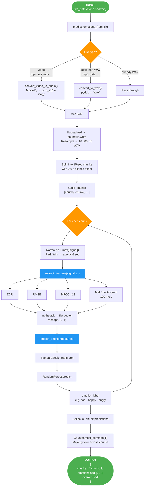

# Speech Emotion Recognition — Pipeline Flow

---

## Module responsible for each step

| Step | What happens | Module |
|---|---|---|
| ① | Detect file type, convert video → WAV or re-encode audio → WAV | `services/media_processor.py` |
| ② | Resample to 16 000 Hz | `pipeline/speech_emotion_pipeline.py` |
| ③ | Split raw audio into 15-sec chunks (0.6 s offset) | `pipeline/speech_emotion_pipeline.py` |
| ④ | Normalise + pad/trim each chunk to 6 sec | `pipeline/speech_emotion_pipeline.py` |
| ⑤ | Extract ZCR · RMSE · MFCC · Mel Spectrogram → flat feature vector | `services/feature_extractor.py` |
| ⑥ | Scale features → Random Forest predict → emotion label | `services/emotion_predictor.py` |
| ⑦ | Majority vote across all chunk predictions → overall emotion | `pipeline/speech_emotion_pipeline.py` |